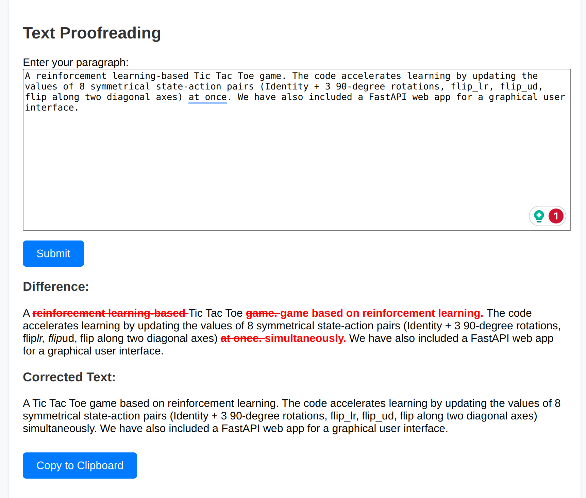

# Proofreading Web App with OpenAI ChatGPT API.

A proofreading web app that utilizes the OpenAI ChatGPT API.

## Installation

```bash
git https://github.com/inteli5/proofreading_chatgpt.git
```
create a virtual environment by, for example, 

```bash
conda create -n proofread python=3.10

```

```bash
conda activate proofread
```


Install required packages.
```bash
python -m pip install -r requirements.txt
```


## Usage


### Web App

In the root directory of the project, run the following command in the terminal:
```bash
python proofread_webapp.py
```
After that, open a web browser and enter the URL 127.0.0.1:8000.




## License

[MIT](https://choosealicense.com/licenses/mit/)